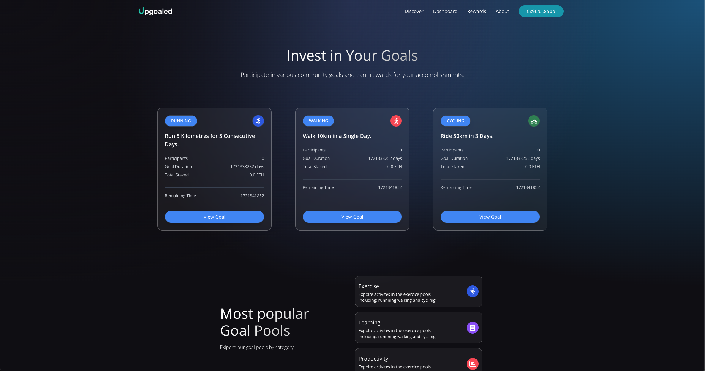

# Goalfi
## A Blockchain-Powered Fitness Goal Platform with Smart Incentives



## Introduction

Goalfi is a decentralized application (dApp) that motivates users to achieve fitness goals by combining financial commitment with blockchain-verified accountability. Users stake cryptocurrency to join fitness challenges, and upon successful completion, they reclaim their stake plus a share of the forfeited stakes from unsuccessful participants. This creates a gamified, competitive environment that encourages personal achievement through financial incentive.

Built on the **Avalanche Fuji Testnet**, Goalfi leverages **Chainlink Functions** for secure, tamper-proof data verification by fetching real activity data from Strava's API. The platform supports various fitness activities including running, cycling, and walking.

## Architecture Overview

### Tech Stack

**Smart Contract Layer**
- Solidity 0.8.20
- OpenZeppelin contracts (Ownable, ReentrancyGuard)
- Chainlink Functions v1.0.0 for oracle services
- Hardhat development environment

**Backend Server**
- Node.js with Express.js
- Event listener for blockchain events
- Ethers.js v6 for blockchain interaction

**Frontend Client**
- React 18 with Vite
- Ethers.js v6 for Web3 integration
- TailwindCSS for styling
- React Router for navigation
- Recharts for data visualization

**External Integrations**
- Strava API for activity tracking
- AWS Lambda for OAuth token management
- MetaMask for wallet connection

## Core Features

### 1. User Account Management
- **Wallet Connection**: MetaMask integration with automatic network switching to Avalanche Fuji
- **Account Creation**: On-chain user registration with minimum balance requirement (0.001 AVAX)
- **Strava Authorization**: OAuth2 flow for linking Strava accounts to wallet addresses
- **Token Management**: Secure storage and refresh of Strava API tokens via AWS Lambda

### 2. Goal Discovery & Participation
- **Browse Goals**: View available fitness challenges with details on activity type, distance, duration, and current participants
- **Stake to Join**: Users commit cryptocurrency before goal start date
- **Activity Categories**: 
  - Walking challenges
  - Running challenges
  - Cycling challenges
- **Time-Locked Stakes**: Funds remain locked in smart contract until goal expiry

### 3. Progress Tracking & Verification
- **Automated Data Fetching**: Chainlink Functions retrieves activity data from Strava API
- **Smart Contract Validation**: On-chain verification of distance completed within timeframe
- **Progress States**: 
  - `JOINED` - User has staked and joined
  - `COMPLETED` - Distance goal met
  - `FAILED` - Distance goal not met
  - `CLAIMED` - Rewards withdrawn

### 4. Reward Distribution System
- **Success Rewards**: Completed participants receive their stake + proportional share of failed stakes
- **Platform Fee**: 2% fee deducted from rewards
- **Failure Penalties**: Failed participants forfeit their entire stake
- **Claim Process**: Users manually claim rewards after goal expiration
- **Transparent Calculation**: Rewards calculated based on:
  ```
  userRewards = (userStake + (totalFailedStake / completedParticipants)) - 2% fee
  ```

### 5. Dashboard & Analytics
- **Personal Statistics**: Track completed vs. failed goals
- **Historical Data**: View all past goal participations
- **Progress Visualization**: Charts showing goal participation over time
- **Activity Tracking**: Monitor distance covered per goal
- **Reward History**: Total rewards earned across all goals

## Smart Contract Architecture

### Key Contracts & Inheritance
```solidity
Goalfi is Ownable, ReentrancyGuard, FunctionsClient
```

### Core Data Structures

**User Struct**
- Wallet address mapping
- Unique user ID
- Goal participation records
- Total rewards accumulated

**Goal Struct**
- Activity type (Run, Ride, Walk)
- Description and distance requirement
- Stake pool and failed stake pool
- Participant tracking
- Start and expiry timestamps

**GoalParticipation Struct**
- Staked amount
- Distance completed by user
- Progress status enum

### Critical Functions

**Admin Functions** (Owner only)
- `createGoal()` - Create new fitness challenges
- `closeGoal()` - Evaluate and finalize expired goals
- `assignDistance()` - Update user progress from Chainlink response
- `executeRequest()` - Trigger Chainlink Functions to fetch Strava data

**User Functions**
- `createUser()` - Register new account
- `joinGoal()` - Stake funds to participate
- `claimRewards()` - Withdraw rewards for completed goals

**View Functions**
- `getUserDistance()` - Check user's progress
- `getParticipantAddresses()` - List all goal participants
- `getUserTotalRewards()` - View lifetime earnings

### Chainlink Functions Integration

The smart contract uses Chainlink Functions to securely fetch activity data from Strava:

1. Admin calls `executeRequest()` with participant tokens and goal parameters
2. Chainlink node executes JavaScript source code (`source.js`)
3. Source code queries Strava API for each participant
4. Filters activities by type, date range, and calculates total distance
5. Returns array of [userId, distance] pairs
6. `fulfillRequest()` callback receives and stores response
7. Backend server listens for `Response` event
8. Calls `assignDistance()` to update participant progress on-chain

## Backend Server

### Express.js Event Listener

The server (`server/express.js`) runs continuously to monitor blockchain events:

```javascript
- Connects to deployed Goalfi contract
- Listens for 'Response' events from Chainlink
- Parses activity data from event
- Calls assignDistance() to update contract state
```

**Key Functions:**
- `assignDistance.js` - Event listener that triggers distance assignment
- `getContractInstance.js` - Creates ethers.js contract instance with provider

## Frontend Client

### Application Structure

**Pages:**
- `Home` - Landing page with service overview
- `Discover` - Browse and join available goals
- `Dashboard` - Personal statistics and goal history
- `About` - Platform information
- `Admin` - Goal management interface (owner only)

**Context:**
- `TransactionContext` - Global state management for:
  - Wallet connection
  - User creation
  - Goal joining
  - Reward claiming
  - Strava authorization
  - Token fetching
  - Data requests via Chainlink

**Key Components:**
- `Navbar` - Wallet connection, user creation, Strava OAuth
- `GoalCard` - Display goal details with join functionality
- `UserGoalCard` - Show user's goal progress
- `DashboardCard` - Statistics display
- `DashboardChart` - Data visualization
- `Modal` - User prompts and confirmations

### User Flow

1. **Connect Wallet** → MetaMask prompts for connection
2. **Create Account** → Registers on-chain (one-time, 0.001 AVAX minimum)
3. **Authorize Strava** → OAuth flow stores tokens in AWS DynamoDB
4. **Browse Goals** → View available challenges on Discover page
5. **Join Goal** → Stake funds before start date
6. **Track Activities** → Record workouts on Strava during goal period
7. **Goal Closes** → Admin triggers data fetch via Chainlink
8. **View Results** → Check progress on Dashboard
9. **Claim Rewards** → Withdraw if goal completed

## Installation & Setup

### Prerequisites
```bash
Node.js v16+
MetaMask browser extension
Strava account
Avalanche Fuji testnet AVAX (from faucet)
```

### Smart Contract Setup

```bash
cd smart_contract
npm install

# Configure environment variables
echo "PRIVATE_KEY=your_wallet_private_key" >> .env
echo "FUJI_RPC=https://api.avax-test.network/ext/bc/C/rpc" >> .env
echo "FUJI_SUBSCRIPTION_ID=your_chainlink_subscription_id" >> .env

# Compile contracts
npx hardhat compile

# Deploy to Fuji testnet
npx hardhat run scripts/deploy.js --network fuji
```

### Backend Server Setup

```bash
cd server
npm install

# Configure environment variables
echo "CONTRACT_ADDRESS=deployed_contract_address" >> .env
echo "PRIVATE_KEY=your_wallet_private_key" >> .env
echo "FUJI_RPC=https://api.avax-test.network/ext/bc/C/rpc" >> .env
echo "PORT=3001" >> .env

# Start server
node express.js
```

### Frontend Client Setup

```bash
cd client
npm install

# Configure environment variables
echo "VITE_CONTRACT_ADDRESS=deployed_contract_address" >> .env

# Start development server
npm run dev
```

## Environment Variables

### Smart Contract
- `PRIVATE_KEY` - Deployer wallet private key
- `FUJI_RPC` - Avalanche Fuji RPC endpoint
- `FUJI_SUBSCRIPTION_ID` - Chainlink Functions subscription ID

### Backend Server
- `CONTRACT_ADDRESS` - Deployed Goalfi contract address
- `PRIVATE_KEY` - Backend wallet private key (for transactions)
- `FUJI_RPC` - Avalanche Fuji RPC endpoint
- `PORT` - Server port (default: 3001)

### Frontend Client
- `VITE_CONTRACT_ADDRESS` - Deployed Goalfi contract address

## Security Features

- **ReentrancyGuard** - Prevents reentrancy attacks on reward claims
- **Ownable** - Restricts admin functions to contract owner
- **Balance Checks** - Ensures sufficient contract balance before transfers
- **Progress Validation** - Only completed goals can claim rewards
- **One-time Claims** - Prevents double-claiming of rewards
- **Time Locks** - Goals cannot be joined after start date
- **Token Security** - Strava tokens stored securely in AWS with refresh logic

## Network Configuration

**Avalanche Fuji Testnet**
- Chain ID: 43113 (0xa869)
- RPC URL: https://api.avax-test.network/ext/bc/C/rpc
- Block Explorer: https://testnet.snowtrace.io/
- Faucet: https://faucet.avax.network/

## Gas Optimization

- Events emitted for off-chain indexing
- View functions for read operations (no gas cost)
- Batch processing of participant evaluations
- Efficient storage packing in structs

## Testing

```bash
cd smart_contract
npx hardhat test
```

## Future Enhancements

- Multi-chain deployment (Ethereum, Polygon, etc.)
- Additional activity types (swimming, rowing, etc.)
- Team-based challenges
- NFT achievement badges
- Governance token for platform decisions
- Social features (leaderboards, friend challenges)
- Mobile app development
- Integration with additional fitness APIs (Fitbit, Garmin, Apple Health)

## Contributing

Contributions are welcome! Please follow these steps:
1. Fork the repository
2. Create a feature branch
3. Commit your changes
4. Push to the branch
5. Open a pull request

## License

This project is licensed under the MIT License.

## Contact & Support

For questions, issues, or feature requests, please open an issue in the repository.

## Acknowledgments

- Chainlink for oracle infrastructure
- Avalanche for fast, low-cost blockchain
- Strava for fitness data API
- OpenZeppelin for secure smart contract libraries