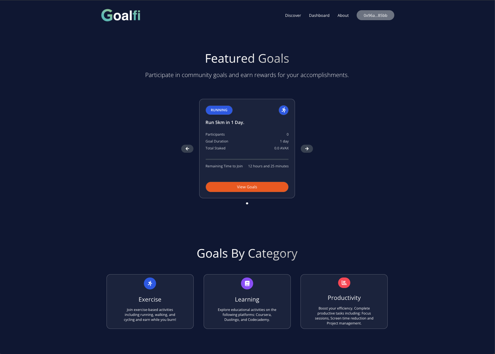

# Goalfi 🏁
## A web3 application designed to motivate goal completion. 

## Introduction
Goalfi is an application that leverages blockchain technology to streamline the way individuals track and accomplish their goals. 
By staking tokens as a commitment to their goals, users are held accountable for their progress. If a goal is not met, the tokens are forfeited and redistributed among users who have successfully accomplished their goals. 
This unique approach adds a competitive edge and fosters collective responsibility and gamifies the process of personal achievements.

## Overview
Goalfi is designed to motivate and reward users for accomplishing quantifiable goals. Users can join predefined goals, stake a certain amount of cryptocurrency, and claim rewards upon goal completion within the stipulated timeframe.
Upgoaled is built in solidity and uses Chainlink Functions for secure and reliable data feeds. The smart contract handles the staking, tracking, and reward distribution, ensuring a robust and transparent application.

## Features
#### User Onboarding:
- Seamless wallet connection: Users can connect their wallets like MetaMask to the platform with ease.
- Goal browsing: A variety of goals are available to be selected by the users.

#### Goal Selection and Staking:
- Users can join a goal by pledging an amount of Cryptocurrency to a goal pool within the smart contract.
- The staked amount is securely locked in the smart contract until the goal's expiration date.

#### Tracking and Goal Verification:
- Activity Tracking: Progress of a users activities from an API is passed to in the smart contract using chainlink functions for secure data verification.
- Progress Visualization: Users can visualize their progress towards the goal in ther Dashboard.

#### Goal Completion and Reward Distribution:
- Upon successful completion of the goal within the specified timeframe, users can claim their rewards.
- Rewards are automatically distributed to eligible users upon successful claim.
- Unclaimed rewards are redistributed among users who completed the goal.
- Users forfeit their staked amount if the goal is not completed within the timeframe.

#### Front End and User Interface:
- The platform provides an intuitive interface for browsing goals, tracking progress, and claiming rewards.
- The responsive design ensures compatibility across various screen sizes and devices.